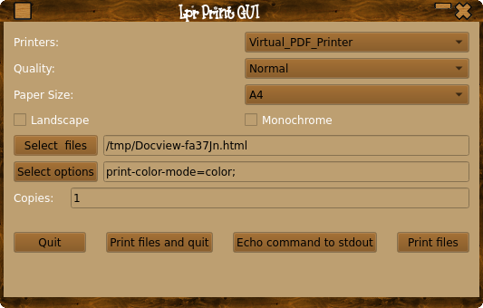

# LprGUI
<br>

QT5 based frontend for lpr cli command.<br>

This is a simple gui frontend to the lpr command, as qt5 doesn't play well with cups, if your app allows you to set a print command you can use this.
There are other GUI's for lp/lpr but they seem to have large dependencies, or need specific librarary versions, this application just needs lpr and lpoptions which are part of CUPS and a reasonable new QT5, which most distros will have installed as default.<br>

You can also use this as a standalone app to print any file.

You will also of course need a build system ( g++,make qt5 dev files etc ).<br>

**Building/Installing:**
```console
make
sudo make install
```
or make DESTDIR="/path/to/install/location" install<br>

Or you can build with qmake:
```console
mkdir build && build
qmake ..
make
sudo make install
```
or make INSTALL_ROOT="/path/to/install/location" install<br>

You can run the application without needing to install it if you just want to try it.<br>
App will now exit gracefully if CUPS is not running or there are no reported printers.<br>

Files to be printed can be selected via the 'Select Files' button or entered into the files box manualy, files should be sepereated by a colon like so:<br>
/media/LinuxData/Development64/CPPScripts/qt5/hilighting/C++.txt.cpp:/media/LinuxData/Development64/CPPScripts/qt5/hilighting/testqthilite.cpp<br>

Options can be entered into the options box seperated by a colon eg:<br>
orientation-requested=6:number-up=4<br>

Custom options override prefs and cli options.<br>

Options are printer dependant and can be found with:<br>
lpoptions -p NAMEOFPRINTER<br>

Finished saving and restoring options, have fun!

BUGS etc.
kdhedger68713@gmail.com